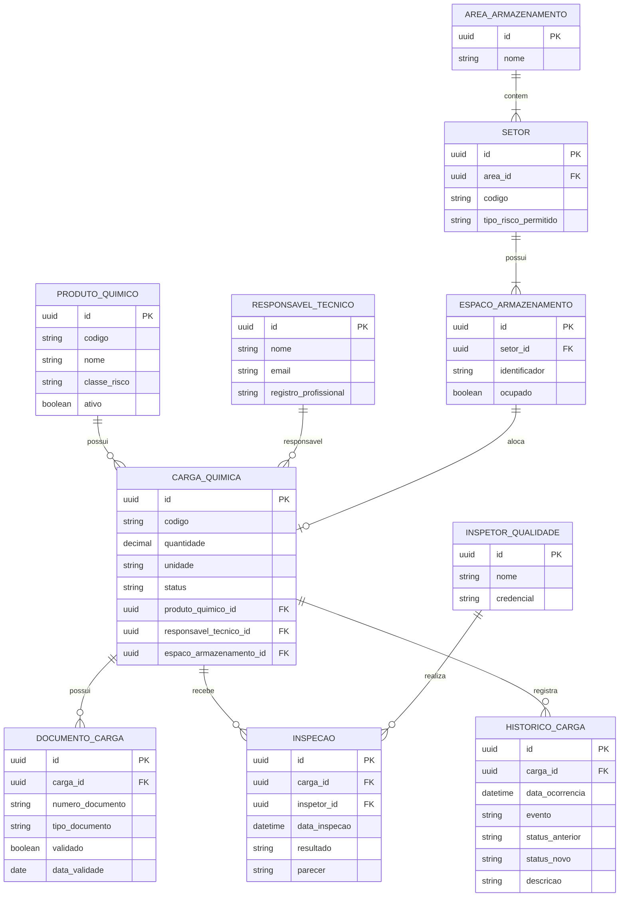
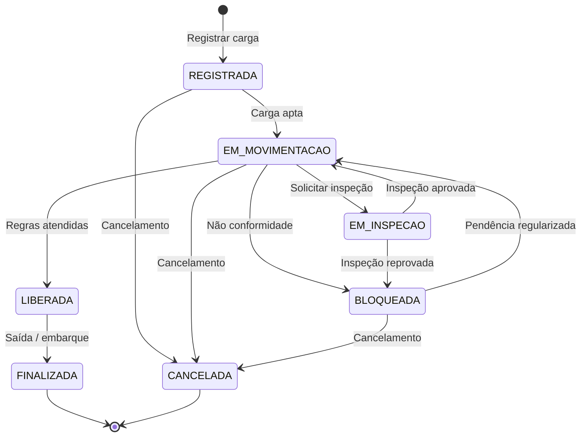
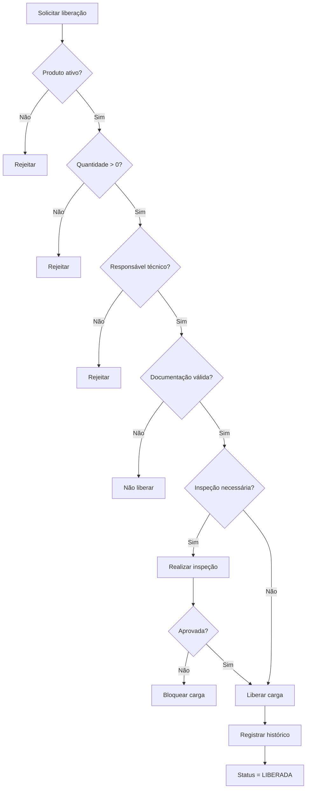
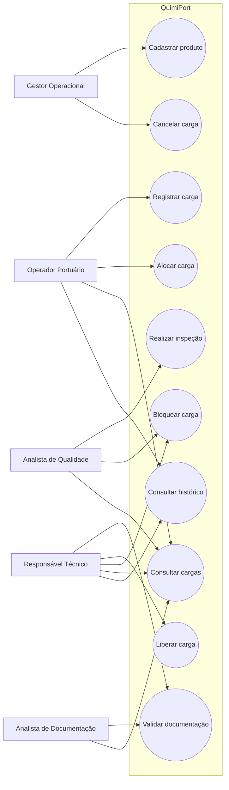

# QuimiPort — Documento de Design de Software

> **Tech Challenge — Pós Tech FIAP | Full Stack Development | Fase 1**
>
> Proposta técnica e arquitetural para o sistema de gestão de cargas químicas portuárias.

---

## 1. Objetivo e escopo

O **QuimiPort** é uma proposta de sistema para organizar o controle de cargas químicas em ambiente portuário, centralizando informações de produtos, cargas, documentação, responsáveis técnicos, inspeções e status operacional.

Esta documentação apresenta a solução técnica solicitada na **Fase 1**, servindo como base para a implementação nas próximas fases.

Nesta etapa, o objetivo é apresentar a concepção da solução, e não uma aplicação completa. O enunciado informa que não é necessário entregar frontend, backend ou banco de dados funcionando nesta fase.

### 1.1 Escopo

O sistema deverá permitir conceitualmente:

- cadastrar produtos químicos;
- registrar cargas químicas;
- associar uma carga a um produto;
- informar classificação de risco;
- registrar documentação obrigatória;
- definir responsável técnico;
- acompanhar o status da carga;
- bloquear ou liberar cargas conforme as regras de negócio;
- validar regras de segurança;
- testar os principais fluxos do domínio.

---

## 2. Entendimento do domínio

### 2.1 Problema

A movimentação de produtos químicos exige controle de informações como classificação de risco, quantidade, documentação, inspeção e responsabilidade técnica.

Quando esse controle é manual ou descentralizado, aumenta a dificuldade para consultar informações, acompanhar o status das cargas e garantir que regras de segurança sejam respeitadas.

O QuimiPort propõe centralizar essas informações e representar as regras de negócio no próprio domínio.

### 2.2 Objetivo da solução

Garantir que uma carga química só avance no processo quando as condições necessárias de segurança, documentação e responsabilidade técnica forem atendidas.

### 2.3 Usuários

| Usuário | Responsabilidade |
|---|---|
| Operador Portuário | Registrar e movimentar cargas |
| Responsável Técnico | Validar documentação e liberar cargas |
| Analista de Documentação | Conferir documentação |
| Analista de Qualidade | Apoiar inspeções e conformidade |
| Gestor Operacional | Administrar cargas e produtos |
| Administrador | Administrar usuários e permissões |

### 2.4 Informações controladas

- produto químico;
- classe de risco;
- quantidade;
- documentação;
- responsável técnico;
- inspeções;
- localização;
- status;
- bloqueios;
- liberações;
- histórico.

---

## 3. Linguagem ubíqua

A linguagem utilizada no código e na documentação deve manter os mesmos conceitos do negócio.

| Termo | Significado |
|---|---|
| **Carga Química** | Carga submetida ao fluxo operacional do porto |
| **Produto Químico** | Produto cadastrado e classificado quanto ao risco |
| **Classe de Risco** | Classificação utilizada para representar o risco do produto |
| **Responsável Técnico** | Profissional responsável pela validação técnica |
| **Documento** | Documento obrigatório associado à carga |
| **Inspeção** | Avaliação técnica realizada sobre a carga |
| **Laudo** | Resultado formal de uma inspeção |
| **Área de Armazenamento** | Local físico destinado às cargas |
| **Setor** | Divisão de uma área de armazenamento |
| **Espaço** | Posição disponível para uma carga |
| **Bloqueio** | Impedimento temporário de movimentação/liberação |
| **Liberação** | Autorização para continuidade do processo |
| **Histórico** | Registro das alterações realizadas na carga |

---

## 4. Modelagem com Domain Driven Design

### 4.1 Entidades

#### CargaQuimica

É a entidade central do domínio e a principal **Aggregate Root**.

Principais atributos:

```text
id
codigo
quantidade
unidade
status
produtoQuimicoId
responsavelTecnicoId
espacoArmazenamentoId
documentos
inspecoes
historico
```

Principais comportamentos:

```text
registrar()
alocar()
iniciarMovimentacao()
iniciarInspecao()
liberar()
bloquear()
cancelar()
finalizar()
```

#### ProdutoQuimico

Representa um produto que pode ser utilizado em cargas.

```text
id
codigo
nome
classeRisco
ativo
```

#### ResponsavelTecnico

Representa o profissional responsável pela validação técnica.

```text
id
nome
email
registroProfissional
```

#### DocumentoCarga

Representa a documentação associada à carga.

```text
id
cargaId
numeroDocumento
tipoDocumento
validado
dataValidade
```

#### Inspecao

Representa uma avaliação técnica.

```text
id
cargaId
inspetorId
data
resultado
parecer
laudo
```

#### HistoricoCarga

Mantém a rastreabilidade das alterações.

```text
id
cargaId
dataOcorrencia
evento
statusAnterior
statusNovo
descricao
usuarioId
```

### 4.2 Objetos de valor

**Quantidade**

```text
valor
unidade
```

Regra: `valor > 0`.

**ClasseRisco**

```text
codigo
descricao
```

Regra: deve possuir uma classificação válida.

**RegistroProfissional**

```text
numero
orgao
```

### 4.3 Agregados

#### CargaQuimica

A `CargaQuimica` é a Aggregate Root principal e protege as regras relacionadas a:

- status;
- documentação;
- inspeções;
- liberação;
- bloqueio;
- cancelamento;
- quantidade;
- responsável técnico.

As alterações devem ocorrer por comportamentos do domínio:

```typescript
carga.liberar(contexto);
```

e não por alteração direta:

```typescript
carga.status = StatusCarga.LIBERADA;
```

#### AreaArmazenamento

Pode ser modelada como uma segunda Aggregate Root, contendo setores e espaços.

A relação com `CargaQuimica` deve ser feita preferencialmente por ID, evitando dependência direta entre agregados.

---

## 5. Diagrama de Entidade-Relacionamento

O modelo abaixo representa as principais entidades e seus relacionamentos.



---

## 6. Regras de negócio

| ID | Regra |
|---|---|
| RN-01 | Produto químico deve possuir nome |
| RN-02 | Produto químico deve possuir classe de risco |
| RN-03 | Produto inativo não pode ser utilizado em nova carga |
| RN-04 | Quantidade da carga deve ser maior que zero |
| RN-05 | Toda carga deve possuir produto associado |
| RN-06 | Toda carga deve possuir responsável técnico |
| RN-07 | Carga não pode ser liberada sem documentação obrigatória válida |
| RN-08 | Carga bloqueada não pode ser movimentada |
| RN-09 | Carga cancelada não pode ser liberada |
| RN-10 | Carga finalizada não pode retornar a um estado operacional |
| RN-11 | Inspeção reprovada deve bloquear a carga |
| RN-12 | Espaço ocupado não pode receber outra carga |
| RN-13 | Espaço deve ser compatível com a classe de risco |
| RN-14 | Alterações relevantes de status devem ser registradas no histórico |

As regras críticas devem ficar protegidas pelo domínio, principalmente as regras de criação da carga e transição de status.

---

## 7. Status e fluxo da carga

### 7.1 Estados

```text
REGISTRADA
EM_MOVIMENTACAO
EM_INSPECAO
LIBERADA
BLOQUEADA
CANCELADA
FINALIZADA
```

### 7.2 Diagrama de fluxo da carga



### 7.3 Fluxo de liberação



---

## 8. Casos de uso

### UC-01 — Cadastrar Produto Químico

**Ator:** Gestor Operacional

**Entrada:**

- código;
- nome;
- classe de risco.

**Resultado:** produto cadastrado como ativo.

**Validações:** nome obrigatório, classe de risco obrigatória e código único.

### UC-02 — Registrar Carga Química

**Ator:** Operador Portuário

**Entrada:**

- quantidade;
- unidade;
- produto;
- responsável técnico.

**Resultado:** carga criada com status `REGISTRADA`.

**Validações:** produto existe e está ativo, quantidade maior que zero e responsável técnico informado.

### UC-03 — Alocar Carga

**Ator:** Operador Portuário

**Entrada:** carga e espaço de armazenamento.

**Resultado:** carga associada a um espaço compatível.

**Validações:** espaço disponível, compatibilidade de risco e carga não bloqueada/cancelada.

### UC-04 — Validar Documentação

**Ator:** Responsável Técnico / Analista de Documentação

**Entrada:** carga, documento e resultado da validação.

**Resultado:** documento validado ou rejeitado.

### UC-05 — Realizar Inspeção

**Ator:** Analista de Qualidade / Inspetor

**Entrada:** carga, resultado, parecer e laudo.

**Resultado:** inspeção registrada e carga aprovada ou bloqueada.

### UC-06 — Liberar Carga

**Ator:** Responsável Técnico

**Pré-condições:**

- produto válido;
- quantidade válida;
- documentação obrigatória válida;
- inspeção obrigatória aprovada;
- carga não bloqueada;
- carga não cancelada.

**Resultado:** carga passa para `LIBERADA` e a alteração é registrada no histórico.

### UC-07 — Bloquear Carga

**Ator:** Responsável Técnico / Inspetor

**Entrada:** carga e motivo.

**Resultado:** carga passa para `BLOQUEADA` e o motivo é registrado.

### UC-08 — Cancelar Carga

**Ator:** Gestor Operacional

**Entrada:** carga e justificativa.

**Resultado:** carga passa para `CANCELADA`.

### UC-09 — Consultar Cargas

Permite consultar cargas por:

- status;
- produto;
- classe de risco;
- período;
- responsável técnico;
- localização.

### UC-10 — Consultar Histórico

Permite verificar:

- ações realizadas;
- usuário responsável;
- data;
- status anterior;
- status posterior;
- motivo da alteração.

---

## 9. Diagrama de casos de uso



---

## 10. Arquitetura proposta

Será utilizada **Clean Architecture**, mantendo o domínio independente dos detalhes de implementação.

### 10.1 Camadas

```text
┌─────────────────────────────────────────┐
│ Infrastructure                          │
│ HTTP, banco, framework e integrações    │
├─────────────────────────────────────────┤
│ Interface Adapters                      │
│ Controllers, Presenters, Repositories  │
├─────────────────────────────────────────┤
│ Application                             │
│ Use Cases, DTOs e Ports                │
├─────────────────────────────────────────┤
│ Domain                                  │
│ Entidades, Agregados e Regras          │
└─────────────────────────────────────────┘
```

**Domain:** entidades, Value Objects, agregados, regras, enums e exceções.

**Application:** casos de uso, DTOs e interfaces de repositories.

**Interface Adapters:** controllers, presenters, mappers e implementações de repositories.

**Infrastructure:** Express, banco, ORM, autenticação, configurações e integrações.

### 10.2 Regra de dependência

```text
Infrastructure
      ↓
Adapters
      ↓
Application
      ↓
Domain
```

O domínio não deve depender de Express, PostgreSQL, ORM, HTTP, controllers ou frontend.

---

## 11. TypeScript e qualidade de código

TypeScript será utilizado como linguagem principal.

### Tipagem forte

```typescript
const carga: CargaQuimica = ...
```

### Interfaces

```typescript
interface CargaRepository {
  findById(id: string): Promise<CargaQuimica | null>;
  save(carga: CargaQuimica): Promise<void>;
}
```

### Enum

```typescript
enum StatusCarga {
  REGISTRADA = "REGISTRADA",
  EM_MOVIMENTACAO = "EM_MOVIMENTACAO",
  EM_INSPECAO = "EM_INSPECAO",
  LIBERADA = "LIBERADA",
  BLOQUEADA = "BLOQUEADA",
  CANCELADA = "CANCELADA",
  FINALIZADA = "FINALIZADA"
}
```

Também serão utilizados, quando aplicável:

- classes para comportamentos de domínio;
- funções puras para validações;
- módulos ES6+;
- `async/await`;
- generics;
- contratos e tipos compartilhados;
- tratamento explícito de erros.

---

## 12. Plano de qualidade e testes

O foco dos testes será garantir as regras críticas do domínio.

### 12.1 Testes unitários

```text
✓ não permitir produto sem classe de risco
✓ não permitir produto inativo em nova carga
✓ não permitir quantidade <= 0
✓ não permitir carga sem responsável técnico
✓ não permitir liberação sem documentação
✓ não permitir movimentação de carga bloqueada
✓ não permitir liberação de carga cancelada
✓ permitir liberação quando todas as regras forem atendidas
✓ validar transições de status
```

### 12.2 Testes de integração

Nas próximas fases:

```text
API
 ↓
Controller
 ↓
Use Case
 ↓
Repository
 ↓
Banco
```

### 12.3 Testes de fluxo

Fluxo positivo:

```text
Registrar
   ↓
Alocar
   ↓
Movimentar
   ↓
Inspecionar
   ↓
Validar documentação
   ↓
Liberar
   ↓
Finalizar
```

Fluxos negativos:

```text
Produto inativo → rejeitar

Documentação inválida → não liberar

Inspeção reprovada → bloquear

Carga bloqueada → impedir movimentação
```

---

## 13. Decisões arquiteturais e evolução

### 13.1 Clean Architecture

Separar as regras de negócio dos detalhes técnicos para facilitar manutenção e evolução.

### 13.2 DDD

Utilizar DDD porque o domínio possui regras importantes relacionadas à segurança, documentação e transições de estado.

### 13.3 Carga como Aggregate Root

`CargaQuimica` concentra as principais invariantes do fluxo operacional e controla suas próprias transições.

### 13.4 Banco de dados

A implementação futura poderá utilizar um banco relacional, como **PostgreSQL**, devido aos relacionamentos entre cargas, produtos, documentos, inspeções e histórico.

A escolha definitiva do banco fica para a fase de implementação.

### 13.5 Evolução futura

```text
Fase 1
  ↓
Modelagem + arquitetura + testes planejados
  ↓
Próximas fases
  ↓
API + banco + frontend
  ↓
Evolução
  ↓
Autenticação + integrações + observabilidade
```

---

## 14. Estrutura de pastas — Clean Architecture

A organização proposta para a implementação futura é:

```text
quimiport/
│
├── docs/
│   └── architecture/
│       └── software-design.md
│
├── src/
│   ├── domain/
│   │   ├── entities/
│   │   │   ├── carga-quimica.entity.ts
│   │   │   ├── produto-quimico.entity.ts
│   │   │   ├── documento-carga.entity.ts
│   │   │   ├── inspecao.entity.ts
│   │   │   └── responsavel-tecnico.entity.ts
│   │   ├── value-objects/
│   │   │   ├── quantidade.vo.ts
│   │   │   ├── classe-risco.vo.ts
│   │   │   └── registro-profissional.vo.ts
│   │   ├── enums/
│   │   │   └── status-carga.enum.ts
│   │   ├── exceptions/
│   │   │   └── domain.exception.ts
│   │   └── services/
│   │
│   ├── application/
│   │   ├── use-cases/
│   │   │   ├── produtos/
│   │   │   │   ├── cadastrar-produto.usecase.ts
│   │   │   │   └── inativar-produto.usecase.ts
│   │   │   └── cargas/
│   │   │       ├── registrar-carga.usecase.ts
│   │   │       ├── alocar-carga.usecase.ts
│   │   │       ├── validar-documentacao.usecase.ts
│   │   │       ├── realizar-inspecao.usecase.ts
│   │   │       ├── liberar-carga.usecase.ts
│   │   │       ├── bloquear-carga.usecase.ts
│   │   │       └── cancelar-carga.usecase.ts
│   │   ├── dto/
│   │   └── ports/
│   │       └── repositories/
│   │           ├── carga.repository.ts
│   │           └── produto.repository.ts
│   │
│   ├── adapters/
│   │   ├── controllers/
│   │   │   ├── carga.controller.ts
│   │   │   └── produto.controller.ts
│   │   ├── presenters/
│   │   └── repositories/
│   │
│   ├── infrastructure/
│   │   ├── http/
│   │   │   ├── app.ts
│   │   │   └── routes/
│   │   ├── database/
│   │   ├── config/
│   │   └── integrations/
│   │
│   └── composition/
│       └── container.ts
│
├── tests/
│   ├── unit/
│   ├── integration/
│   └── e2e/
│
├── README.md
├── package.json
└── tsconfig.json
```

| Pasta | Responsabilidade |
|---|---|
| `domain` | Regras e modelos do negócio |
| `application` | Casos de uso |
| `adapters` | Comunicação entre aplicação e mundo externo |
| `infrastructure` | Frameworks, banco e integrações |
| `composition` | Montagem das dependências |
| `tests` | Testes unitários, integração e E2E |
| `docs` | Documentação técnica |

---

## 15. Conclusão

O QuimiPort será estruturado como uma solução orientada ao domínio, tendo a `CargaQuimica` como elemento central.

A proposta contempla os principais pontos solicitados para a Fase 1:

- entendimento do domínio;
- usuários e processos;
- linguagem ubíqua;
- entidades;
- Value Objects;
- agregados;
- regras de negócio;
- casos de uso;
- diagrama de entidade-relacionamento;
- diagrama de fluxo da carga;
- diagrama de casos de uso;
- arquitetura proposta;
- aplicação de TypeScript;
- plano de qualidade;
- decisões arquiteturais;
- estrutura para evolução do projeto.

A aplicação completa será desenvolvida nas próximas fases, mantendo o domínio independente da infraestrutura e permitindo sua evolução para backend, frontend, banco de dados e integrações.

---

## Referências

- **Tech Challenge — Fase 1 — Pós Tech FIAP Full Stack Development**
- Repositório: `https://github.com/feldmannmts/Projeto_P-s_Tech_FIAP_FULLSTACK_Fase-1`
